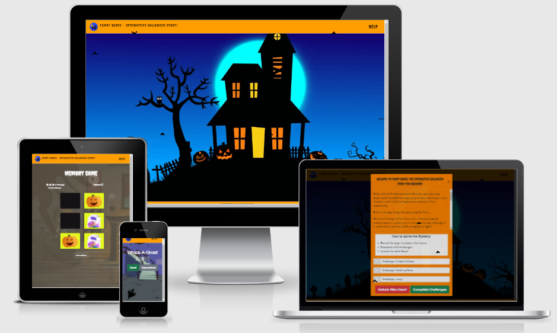
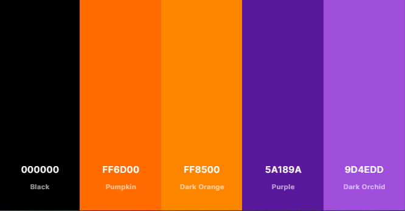
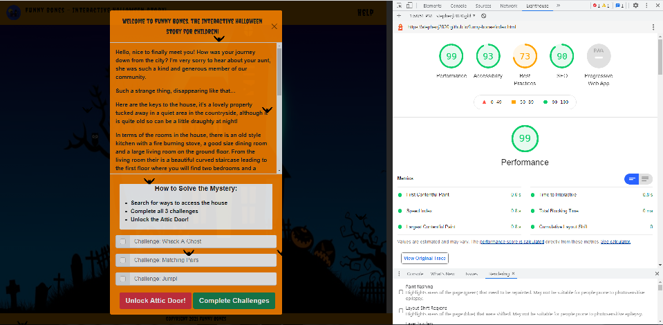
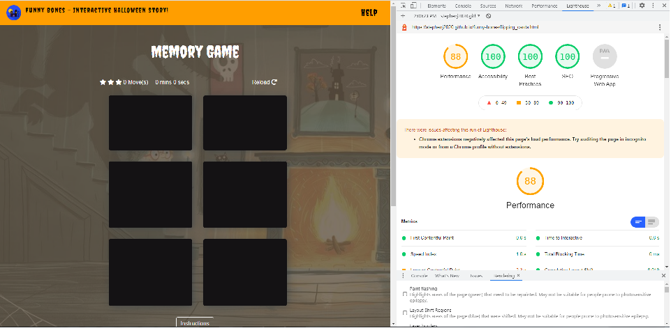
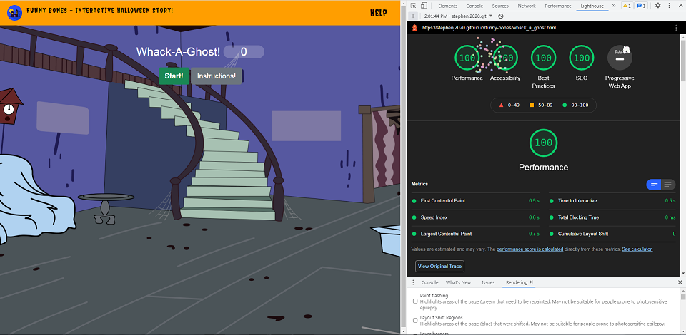
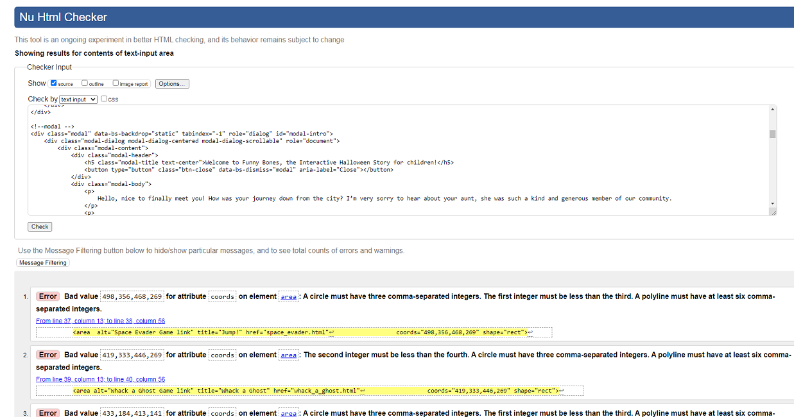
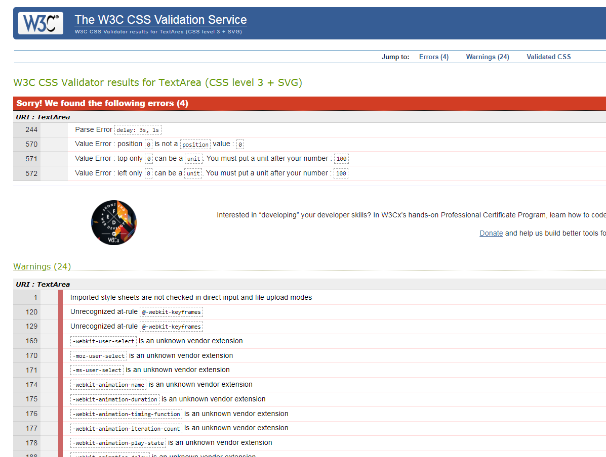
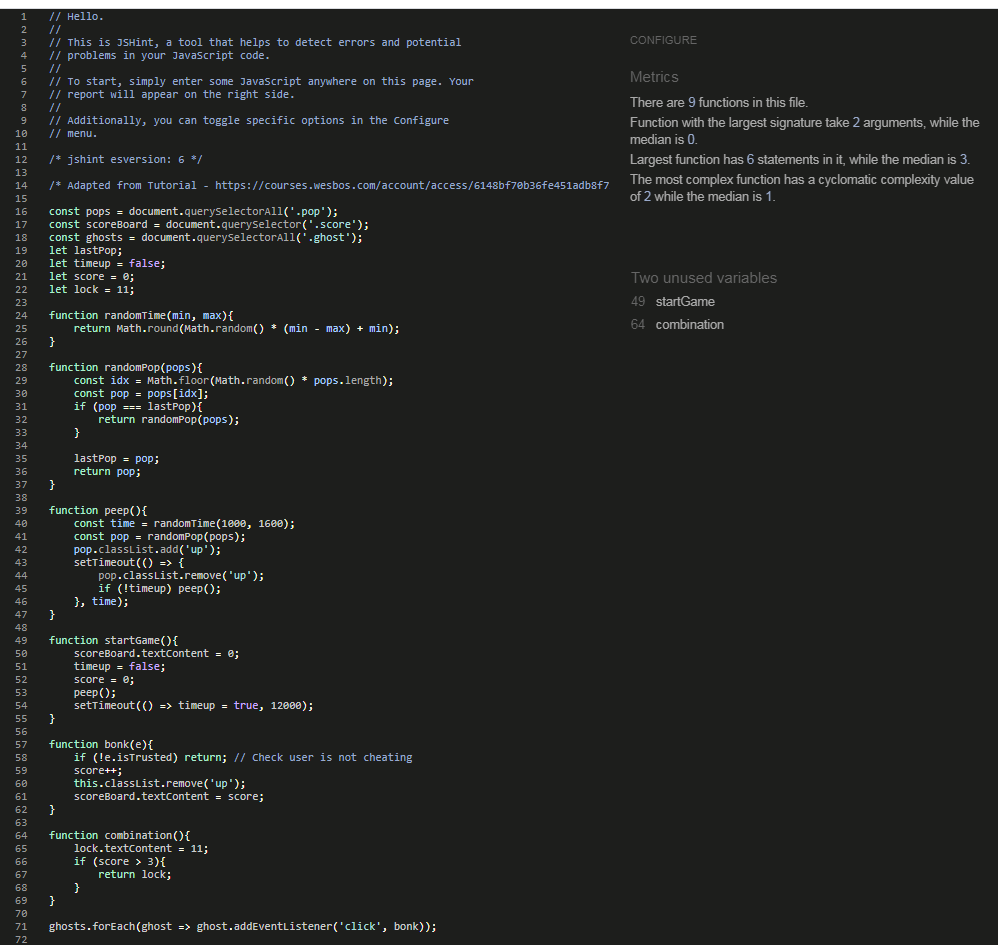

[](https://stephenj2020.github.io/funny-bones/index.html) 

This project was created for Code Institute's Halloween 'Spookathon' - October 2021 by the Funny Bones team.   
The main goal of the Funny Bones Interactive Adventure Story Book is to familiarize children with popular Halloween stories in a fun, play-based way. 

In this interactive app, children are the creators of their own story!

[Funny Bones - Live Site](https://stephenj2020.github.io/funny-bones/index.html)  

    
  
  
# Funny Bones  
------  
## [Table of Contents](#table-of-contents)

- [UX](#ux)
  * [Strategy](#strategy)
  * [User Stories](#user-stories)
  * [Scope](#scope)
  * [Structure](#structure)
  * [Skeleton](#skeleton)
  * [Surface](#surface)
    + [Color Scheme](#color-scheme)
    + [Typography](#typography)
    + [Imagery](#imagery)
- [Technologies Used](#technologies-used)
  * [Languages](#languages)
  * [Frameworks, Libraries, Programs & Platforms Used:](#frameworks--libraries--programs---platforms-used-)
- [Features](#features)
  * [Implemented Features](#implemented-features)
  * [Future Features](#future-features)
- [Bugs & Fixes](#bugs---fixes)
- [Deployment](#deployment)
  * [Deployment Steps](#deployment-steps)
  * [Making a clone to run locally](#making-a-clone-to-run-locally)
  * [How to Fork the respository](#how-to-fork-the-respository)
  * [Making a Local Clone](#making-a-local-clone)
- [Testing](#testing)
  * [Code Validity](#code-validity)
  * [Testing User Stories](#testing-user-stories)
- [Credits](#credits)
- [Acknowledgements](#acknowledgements)


# UX
___
## Strategy

* **Project Goals**
    * To create a fully-optimized responsive interactive story book app for flawless user experience on all devices. 
    * To create a platform that allows all users to learn popular Halloween stories in a fun, play-based way. 

* **Business Goals**   
    * A simple minimalistic app that is easy to use on all devices.
    * To create a fun game, so users return to play again.

* **Target audience**
    * Parents with young children aged 7-12.


## User Stories

* **As a first time user I want to be able to:**  

    * Navigate the site intuitively and easily access all available features from different screen size devices.
    * Understand the game instructions easily.
    * Develop learning skills in young children.
    * Be able to complete the game to win.
    * Have a positive and fun experience.  

   
* **As a returning user I want to be able to:**  
    * Play the game without any detours.
  

[:top:](#funny-bones)

## Scope  
------  
* To create a user friendly and simple to use interactive story book app using HTML, CSS, JavaScript and Bootstrap. 
* Intuitive design: allow users to navigate the site intuitively, play games and learn the stories.

  
## Structure  
------  
The app consists of 5 pages in total.

### The Game Pages
3 of the pages are "game" pages, that is, they each display a different type of simple game.  
The 3 games that we have decided on are as follows:  
#### Flipping Cards  
The user is asked to memorise the position of cards and click on the pairs.
#### Whack-a-Ghost
Inspired by whac-a-mole, the user must click on the disappearing ghosts.
####  Jump! Game  
The user must jump over the moving pumpkins.

### The Landing Page
The main page that displays the picture of the haunted house and contains various pop-ups and modals to tell the story and provide interactivity.

### The Final Page
Similar to the main page this would contain pop-ups and scrollable text and would be set against a picture of an attic as this is where the story ends.

### Notes  
The main page is the first page the user will come across.  The user then has the option to naviage to any of the 3 "Game Pages".  Once they have completed this
they will be able to access the final page to finish the story.


The app consists of the landing page with the game instructions and a 'Play Now' button, three game pages, that allow users to unlock the story endings by winning the games and the 'Play Again' page.  
  
## Skeleton
------  
* Project wireframes can be found [HERE](assets/images/funny-bones-wf.pdf)    

* Wireframes were created using Balsamiq Wireframes at the planning stage of the project. 
  
  
[:top:](#funny-bones)
  

## Surface 
-----
### Color Scheme  

  
To create the color palette we used [Coolors](https://coolors.co/).

Hues of orange, purple and black were chosen for this project as they are traditional colors of Halloween. Combination of these colors are warm and stimulating and grab children's attention.

### Typography

* Google Fonts _*Griffy*_ and _*Creepster*_ were used accross the site for a fayrytale look and feel with a touch of spooky just to give you the creeps.
  
### Imagery  

**(imagery choice goes here)**  


# Technologies Used  
------  
## Languages

* **HTML5**
* **CSS3**
* **Javascript**  

## Frameworks, Libraries, Programs & Platforms Used:   

* **Bootstrap5** - used to create a layout and to build a responsive design, which is compatible with all modern browsers. 
* **Git** - used for version control and to keep track of the changes made to the repository.
* **GitHub** - used as a hosting service for version control and collaborations.
* **Balsamiq** - to create a mockup to allow me to plan the layout and content of the website.
* **Coolors** was used to create the color palette for this project.
* **Google Fonts** - ___ font has been used throughout the website.


[:top:](#funny-bones)

# Features  
------  

## Implemented Features
*   Landing Page  
The page has a modal that pops up on the page loading. The modal has scrolling text that introduces the story as well
as tick boxes to select the challenges that you have completed.  Finally, there is a card that displays tips for how
to play the game.
The main page itself displays an image of a haunted house, of which the windows and doors are clickable and each of which takes you to one of the three different games.

*   Whack-a-ghost
Game in which the user is required to click on moving images.  If they manage to do this enough times they are deemed to have passed the challenge.
There is also a modal displaying instructions that can be toggled with a button.

*   Jump!
Game in which the user is required to jump over the moving image.  If they are not successful, they are presented with 
a button to try again.  If they are successful 5 times in a row, a message is displayed displaying a success message.

*   Flipping Cards
The user is presented with 6 cards and must remember their order once they have been clicked.  Once successful, a modal
pops up presenting information relating to the game that has just finished.

*   Final Page
There is a different background image from the main page.  There is scrollable text on a semi-opaque background that 
completes the story. 

*   Help Page
There is a bootstrap accordion that is split into three sections each of which referring to one of the games.  On being 
clicked each section displays intructions for the games.

  
  
## Future Features
  
*   Unlock Feature  
In this version the final page is accessible by clicking the button that is displayed on the main page modal.  The 
original plan, however, was for each game to input a code and for the three codes to be requested before entry is granted
to the final page.

*   Jump! Game  
The Jump! game originally was intended to have different heights of moving objects in order to lend variety to the game.

  
  
# Bugs & Fixes  
------  
**Bugs and fixes to go here**  

Issue:  The live site was not displaying the images properly for the Jump! Game even though they were displaying when
the site was run from individual machines.   
Fix:  The images were changed from being imported via a fixed path to a relative path.

Issue:  Trying to merge the Jump! game branch to the main branch caused several conflicts that were proving difficult to 
resolve.  When attempting to resolve the conflicts a chunk of code was deleted.  
Fix:  Import the deleted code from the backup and resolve the conflicts manually in github browser rather than in the 
gitpod file.

  
[:top:](#funny-bones)

# Deployment  
------  
  
## Deployment Steps  
  
This project was deployed to GitHub Pages following these steps:  
  
1. Login to GitHub  
2. Locate the following GitHub Repository name in the Search Bar: StephenJ2020/funny-bones  
3. Click into the repository to view more details
4. Click on Settings, located on the menu tab just below the repository name  
5. On the Menu options on the left select the second last option "Pages"
6. Under Source, select Master in the dropdown menu   
7. Select /(root) in the tab that is next to Branch selector     
8. Click Save and page will automatically refresh
9. You will now see a link to the deployed website   
10. To view the deployed website [click here!]()  
  
  
## Making a clone to run locally  
  
It is important to note that this project will not run locally unless an env.py file has been set up by the user which contains the IP, PORT, MONGO_DBNAME, MONGO_URI and SECRET_KEY which have all been kept secret in keeping with best security practices.  
  
1. Log into GitHub.  
2. Select the [respository](https://github.com/StephenJ2020/funny-bones).    
3. Click the Code dropdown button next to the green Gitpod button.  
4. Download ZIP file and unpackage locally and open with IDE. Alternatively copy the URL in the HTTPS box.  
6. Type 'git clone' and paste the copied URL.  
7. Press Enter. A local clone will be created.  
  
Once the project been loaded into the IDE it is necessary to install the necessary requirements which can be done by typing the following command.  
  
    -pip install -r requirements.txt  
  
    
## How to Fork the respository  
  
By forking the GitHub Repository you make a copy of the original repository on your own GitHub account to view and/or make changes without affecting the original repository by following these simple steps:  
  
1. Log in to GitHub and locate the [StephenJ2020/funny-bones Repository](https://github.com/StephenJ2020/funny-bones)  
2. Near the top of the Repository, on the right-hand side of the screen, locate the "Fork" button.  
3. Click this button and you should now have a copy of the original repository in your GitHub account.  
    
## Making a Local Clone 
  
1. Log in to GitHub and locate the [StephenJ2020/funny-bones Repository](https://github.com/StephenJ2020/funny-bones)  
2. Under the repository name, click "Clone or download".  
3. To clone the repository using HTTPS, under "Clone with HTTPS", copy the link.  
4. Open Git Bash  
5. Change the current working directory to the location where you want the cloned directory to be made.  
6. Type `git clone`, and then paste the URL you copied in Step 3.  
```  
$ git clone https://github.com/StephenJ2020/funny-bones  
```  
7. Press Enter. Your local clone will be created.  
```  
$ git clone https://github.com/StephenJ2020/funny-bones  
> Cloning into `CI-Clone`...  
> remote: Counting objects: 10, done.  
> remote: Compressing objects: 100% (8/8), done.  
> remove: Total 10 (delta 1), reused 10 (delta 1)  
> Unpacking objects: 100% (10/10), done.  
```   

[:top:](#funny-bones)

# Testing  
------  
## Code Validity
* LightHouse Scores:  
  -   
  -   
  -   
    
* HTML Markup Validation Service - 
   
* CSS Validation Service -  
  
* JavaScript Code Quality Tool JSHint -  
  
  
## Testing User Stories
* *First time user stories:*
    * 
    * 

* *Returning user stories:*


  
# Credits  
------  
* Table of contents generated with [markdown-toc](http://ecotrust-canada.github.io/markdown-toc/).
* Favicon is taken from [Flaticon](https://www.flaticon.com/).

* Whack-A-Ghost:  
  - [Wes Bos Tutorial](https://courses.wesbos.com/account/access/6148bf70b36fe451adb8f730/view/194158577)  
  - [Base HTML](https://github.com/wesbos/JavaScript30/blob/master/30%20-%20Whack%20A%20Mole/index-START.html)  
  - [CSS file](https://github.com/wesbos/JavaScript30/blob/master/30%20-%20Whack%20A%20Mole/style.css)   
  - [Ghost image](https://www.kissclipart.com/ghost-sj3t4l/)  

* [Image map tool](https://www.image-map.net/)
* To make image map responsive [RWD Image Maps](https://github.com/stowball/jQuery-rwdImageMaps)


* Jump!
  - [Jump! tutorial](https://www.youtube.com/watch?v=bG2BmmYr9NQ&t=300s&ab_channel=KnifeCircus)  
  - The above tutorial was used as inspiration for the Jump! game.


* [Image for Jump Game](https://storybird.s3.amazonaws.com/artwork/Jevs/full/scientist-haunted-house.jpeg)  
* [Image for Whack-a-ghost](https://images-wixmp-ed30a86b8c4ca887773594c2.wixmp.com/i/3022922d-d7d2-447e-8a28-343d228f0b0e/d5jlspq-e8627073-b94d-4efc-8d00-356c544bcc3d.png)  
* [Image of ghost](https://cdn.imgbin.com/19/14/15/imgbin-ghost-silhouette-ghost-eShcjvqbimNytaYEVJfQPYt6k.jpg)  
* [Image for Memory Game](https://storybird.s3.amazonaws.com/artwork/Jevs/full/haunted-wolf-house.jpeg)  
  
  


# Acknowledgements  
------  
* We would like to thank our wonderful Facilitator Kasia for all her help, advice and enthusiasm!  
* We would also like to thank everyone involved in organising and running this Hackathon as it has been a fantastic learning experience!  

  


[:top:](#funny-bones)
