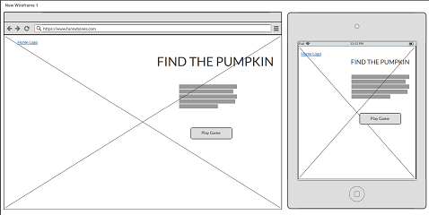

   
  


[Funny Bones - Live Site]()

# Funny Bones
------
## Table of Contents
------

* Strategy
* User Stories
* Client Goals
* Scope
* Features & Functional Requirements
* Structure
* Content and Structure requirements
* Skeleton
* Wireframes
* Design Inspiration and color choices
* Typography
* Imagery
* Core Features
* Future Implementations
* Bugs & Fixes
* Implementation
* Deployment
* To deploy to GitHub Pages
* Forking the GitHub Repository
* Making a Local Clone
* Testing
* Technologies Used
* Languages Used
* Frameworks, Libraries, Programs & Platforms Used
* Credits
* Acknowledgements


## Strategy
------
 
 
**The main goal of the Funny Bones site is to:**

* 
* 
* 
* 
 
 
## Primary USER -  Parents with young children aged approx. 7-12 years old
------
**As a first time user I would like to:**
* 
* 
* 
* 
*  
* 

**Nice to have:**

* 
* 


**As a repeat user I would like to:**
* 
* 
* 
* 
* 


## Site Owners Goals 
------
* 
* 
* 
* 


## Scope
------

### Features & Functional Requirements
------

* 
* 
* 
* 
* 


#### UX
------


## Structure
------


#### Skeleton
------


#### Wireframes
------
* Wireframes were created using the [Balsamiq](https://balsamiq.com/wireframes/) software.
*   
* [View full PDF version](assets/images/rm-funny-bones wf.pdf)  


A pdf of the wireframes can be found [here](doc/wireframes/soda-apply_wireframes.pdf), by clicking on the download button in Github. (**Please Note:** _[Adobe Acrobat Reader](https://get.adobe.com/reader/) is required to view files in pdf format_).

#### [Back to top](<#table-of-content>)


#### Design Inspiration & Colour choices
------
 
#### Typography
------
 

#### Imagery
------
**(imagery chose goes here)**


#### Core Features
------
* 
* 
* 
* 


#### Future Implementations
------

* 
* 
* 
* 


#### Bugs & Fixes
------
**Bugs and fixes to go here**


#### Implementation
------


#### Deployment
------


### Deployment Steps


### Making a clone to run locally

It is important to note that this project will not run locally unless an env.py file has been set up by the user which contains the IP, PORT, MONGO_DBNAME, MONGO_URI and SECRET_KEY which have all been kept secret in keeping with best security practices. 

1. Log into GitHub.
2. Select the [respository](https://github.com/StephenJ2020/funny-bones).  
3. Click the Code dropdown button next to the green Gitpod button.
4. Download ZIP file and unpackage locally and open with IDE. Alternatively copy the URL in the HTTPS box.
5. Open the alternative editor and terminal window.
6. Type 'git clone' and paste the copied URL.
7. Press Enter. A local clone will be created.

Once the project been loaded into the IDE it is necessary to install the necessary requirements which can be done by typing the following command.

    -pip install -r requirements.txt

### How to Fork the respository.

By forking the GitHub Repository you make a copy of the original repository on your own GitHub account to view and/or make changes without affecting the original repository by following these simple steps:

1. Log in to GitHub and locate the [StephenJ2020/funny-bones Repository](https://github.com/StephenJ2020/funny-bones)
2. Near the top of the Repository, on the right-hand side of the screen, locate the "Fork" button.
3. Click this button and you should now have a copy of the original repository in your GitHub account.
  
### Making a Local Clone

1. Log in to GitHub and locate the [StephenJ2020/funny-bones Repository](https://github.com/StephenJ2020/funny-bones)
2. Under the repository name, click "Clone or download".
3. To clone the repository using HTTPS, under "Clone with HTTPS", copy the link.
4. Open Git Bash
5. Change the current working directory to the location where you want the cloned directory to be made.
6. Type `git clone`, and then paste the URL you copied in Step 3.
```
$ git clone https://github.com/StephenJ2020/funny-bones
```
7. Press Enter. Your local clone will be created.
```
$ git clone https://github.com/StephenJ2020/funny-bones
> Cloning into `CI-Clone`...
> remote: Counting objects: 10, done.
> remote: Compressing objects: 100% (8/8), done.
> remove: Total 10 (delta 1), reused 10 (delta 1)
> Unpacking objects: 100% (10/10), done.
``` 

#### Testing
------


#### Technologies Used
------
* Languages Used:  
	* HTML5  
	* CSS3  
	* Javascript  
* Frameworks, Libraries, Programs & Platforms Used:   
		* Bootstrap5  


#### Credits
------

#### Acknowledgements
------